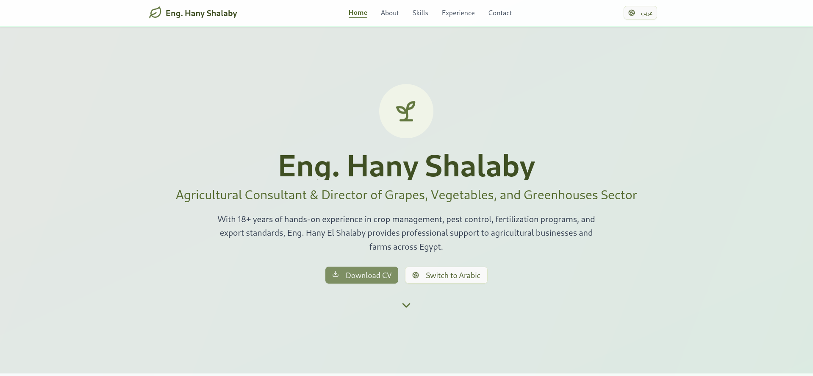

# Hany Shalaby – Agricultural Consultant 🌿

A professional portfolio website for **Eng. Hany Shalaby**, an Agricultural Consultant and Technical Support Engineer in the field of agricultural pesticides.

## Table of Contents

- [Overview](#overview)
  - [Screenshot](#screenshot)
  - [Links](#links)
- [Features](#features)
- [Tech Stack](#tech-stack)
- [How to Use](#how-to-use)
- [Author](#author)

---

## Overview

### Screenshot



### Links

- **Live Demo**: [https://hanyshalaby.netlify.app](https://hanyshalaby.netlify.app)
- **GitHub Repo**: [https://github.com/OmarHany-sudo/Hany-Shalaby](https://github.com/OmarHany-sudo/Hany-Shalaby)

---

## Features

- 👨‍🌾 Personal branding and information display
- 📱 Responsive across all devices
- 🧭 Simple, easy-to-navigate layout
- 🟢 Olive green theme to match the agricultural identity
- 🌍 Language toggle (Arabic / English)

---

## Tech Stack

- **HTML5** – Clean and semantic markup  
- **CSS3** – Custom styles with responsive design  
- **JavaScript** – For interactivity and toggles  
- **Netlify** – For fast and free deployment

---

## How to Use

1. **Clone** the repository:

   ```bash
   git clone https://github.com/OmarHany-sudo/Hany-Shalaby.git
   ```

2. Navigate to the project directory:

   ```bash
   cd Hany-Shalaby
   ```

3. You can open `index.html` directly in your browser or use Live Server in VS Code.

---

## Author

- 👨‍💻 **Website** – [Omar Hany](https://omarhany.netlify.app)
- 💼 **LinkedIn** – [@omar-hany-l850](https://www.linkedin.com/in/omar-hany-l850)
- 📘 **Facebook** – [@Omar.Hany.850](https://www.facebook.com/Omar.Hany.850)
- 📸 **Instagram** – [@omar.hany.850](https://www.instagram.com/omar.hany.850)